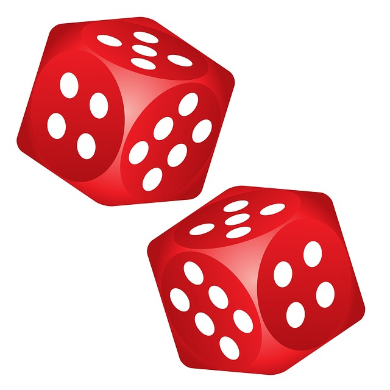

# Roll Dice Game 🎲



Java is a high-level, class-based, object-oriented programming language that is designed to have as few implementation dependencies as possible. It is a general-purpose programming language intended to let programmers write once, run anywhere (WORA), meaning that compiled Java code can run on all platforms that support Java without the need to recompile. Java applications are typically compiled to bytecode that can run on any Java virtual machine (JVM) regardless of the underlying computer architecture. The syntax of Java is similar to C and C++, but has fewer low-level facilities than either of them. The Java runtime provides dynamic capabilities (such as reflection and runtime code modification) that are typically not available in traditional compiled languages. As of 2019, Java was one of the most popular programming languages in use according to GitHub, particularly for client–server web applications, with a reported 9 million developers.


## Let's get to know the game 🎮

By pressing the user play button, two dice are randomly rolled. The images and values ​​of the rolled dice are displayed on the screen. As a next step, the user's victory, draw or loss can be displayed on the screen. With the dice game, you can relieve stress and have fun.


##  Screenshots 🖼

  

## License ℹ️
```
MIT License

Copyright (c) 2022 Halil Özel

Permission is hereby granted, free of charge, to any person obtaining a copy
of this software and associated documentation files (the "Software"), to deal
in the Software without restriction, including without limitation the rights
to use, copy, modify, merge, publish, distribute, sublicense, and/or sell
copies of the Software, and to permit persons to whom the Software is
furnished to do so, subject to the following conditions:

The above copyright notice and this permission notice shall be included in all
copies or substantial portions of the Software.

THE SOFTWARE IS PROVIDED "AS IS", WITHOUT WARRANTY OF ANY KIND, EXPRESS OR
IMPLIED, INCLUDING BUT NOT LIMITED TO THE WARRANTIES OF MERCHANTABILITY,
FITNESS FOR A PARTICULAR PURPOSE AND NONINFRINGEMENT. IN NO EVENT SHALL THE
AUTHORS OR COPYRIGHT HOLDERS BE LIABLE FOR ANY CLAIM, DAMAGES OR OTHER
LIABILITY, WHETHER IN AN ACTION OF CONTRACT, TORT OR OTHERWISE, ARISING FROM,
OUT OF OR IN CONNECTION WITH THE SOFTWARE OR THE USE OR OTHER DEALINGS IN THE
SOFTWARE.
```
