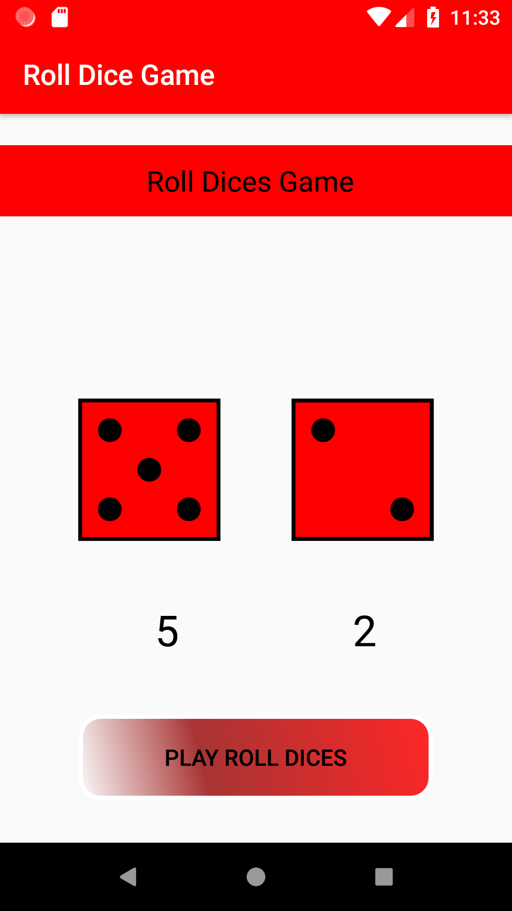
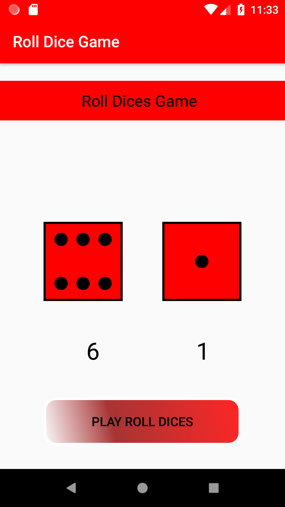
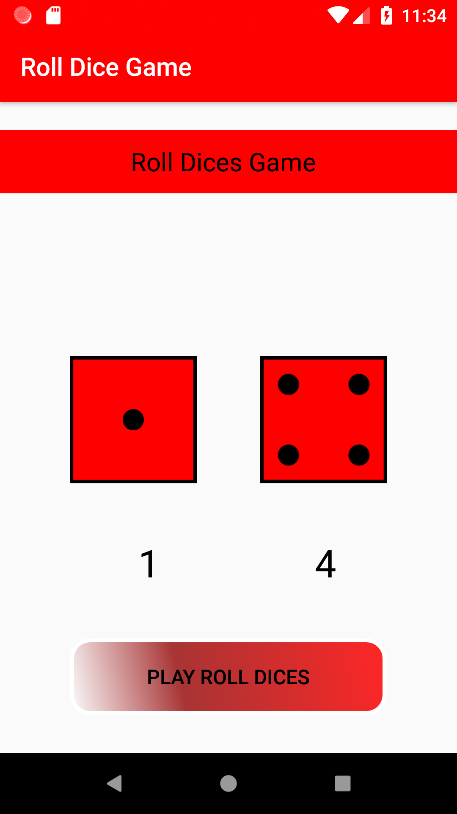

# Roll Dice Game 🎲

Simple Android dice roller app built with Java.


## Overview

This project is a basic two-dice rolling game:

- Tap **Play / Roll Dices**
- Two random dice values (1-6) are generated
- Dice images are updated on screen
- Numeric results are shown under each dice

## Tech Stack

- Java
- Android SDK
- Gradle

## Project Structure

- `/app/src/main/java/com/halil/ozel/rolldicegame/MainActivity.java` - game logic
- `/app/src/main/res/layout/activity_main.xml` - main UI layout
- `/app/src/main/res/drawable/` - dice and button assets

## Build & Run

1. Open the project in **Android Studio**
2. Let Gradle sync complete
3. Run the app on an emulator or Android device

Or use the Gradle wrapper:

```bash
./gradlew assemble
```

## Screenshots 🖼️





## License

This project is licensed under the MIT License.
